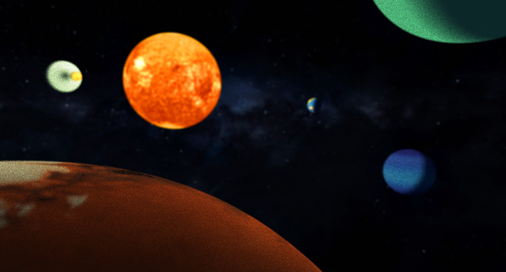
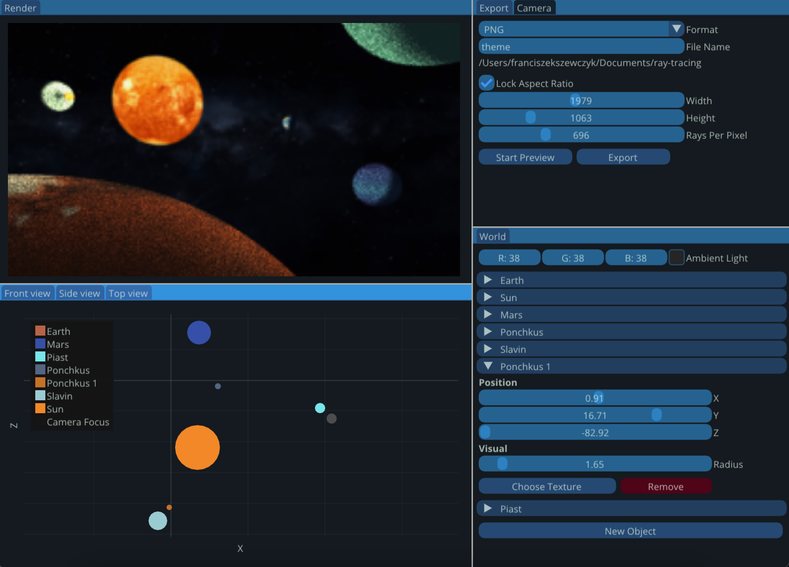

<div align="center">
 
<h1>SHKYERA Engine</h1>

<div>
  
 
 
[](LICENSE) 
  
</div>

</div>


## Quick start
### Linux and MacOS
_Tested on Ubuntu 20.04 and MacOS Monterey (Intel)_

Everything should be taken care of if you just do this.

```sh
chmod +x ./build.sh
./build.sh -r
```

## Using the Engine

### Camera
Once you click on the top-left **Render** window. You can move the camera freely using:
1. W - forward
2. A - left
3. S - backwards
4. D - right
5. E - up
6. Q - down

If you hold left mouse button, you can freely rotate the camera.

In the top-right **Camera** window, you can manually select camera's position as well as its:
1. Depth of Field - "blur effect"
2. Focus Distance - focus of the camera
3. Field of View - camera "zoom"

Camera's position can also be manipulated on the plots in the bottom-left window.

### Planets
Click "Add New Object" in the **World** menu in the bottom-right window to create a new planet.

By clicking on one of the planet's names, you can manipulate its:
1. Position
2. Size
3. Texture
4. Remove the object

In the _Texture_ Menu, you can choose planet's color and press _Set Color_ to apply changes or choose one of the preloaded textures.

You have to select _Emit Light_ checkbox in order to emit light from that object. You can also change light's color and intensity. If you want to apply these changes, you have to select the texture **again** or _Set Color_.

### Ambient Light
Change Ambient Light in the **World** window to alter the color that the "unvierse" shines onto the objects.

## Plots
In the bottom-left window, you can see your world from all three different sides. You can drag and drop the planets as well as the camera. You can also see the focus distance of the camera. This is especially useful if you have high Depth of Field.

## Resources
1. [_Ray Tracing in One Weekend_](https://raytracing.github.io/books/RayTracingInOneWeekend.html)
2. [_Atta_](https://github.com/brenocq/atta)
3. [_The Cherno's raytracing series_](https://www.youtube.com/watch?v=gfW1Fhd9u9Q&list=PLlrATfBNZ98edc5GshdBtREv5asFW3yXl)
4. [_Planets' textures_](https://www.solarsystemscope.com/textures/)
